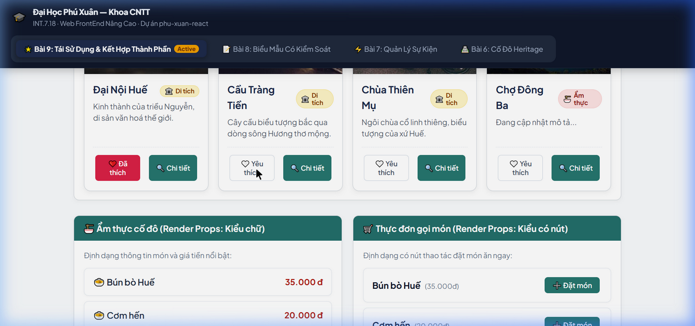

# phu-xuan-react — Thực Hành INT.7.18 (Web FrontEnd Nâng Cao)
Trường Đại học Phú Xuân — Khoa Công nghệ Thông tin

Dự án phát triển trên nền tảng **React 19 + Vite**, hoàn thiện đầy đủ nội dung bài thực hành Bài 8 và Bài 9 theo hướng dẫn chính thức.

---

## Cài đặt & Chạy dự án

```bash
npm install
npm run dev
```

Mở trình duyệt truy cập: [http://localhost:5173](http://localhost:5173)

---

## 🌟 BÀI 9: TÁI SỬ DỤNG VÀ KẾT HỢP THÀNH PHẦN

### 1. Các thành phần đã xây dựng (Checklist bắt buộc)
- `TheDiaDanh` (`src/components/TheDiaDanh.jsx`): Thẻ địa danh tái sử dụng qua props, có giá trị mặc định cho `moTa = "Đang cập nhật mô tả..."`.
- `The` (`src/components/The.jsx`): Thành phần khung "vỏ hộp" bọc nội dung bất kỳ bằng thuộc tính `children`, có thanh tiêu đề kết xuất có điều kiện `{tieuDe && ...}`.
- `BoCucTrang` (`src/components/BoCucTrang.jsx`): Bố cục trang với 3 khe JSX riêng biệt (`thanhDieuHuong`, `noiDungChinh`, `chanTrang`).
- `HopThongBao` & `HopThongBaoThanhCong` (`src/components/HopThongBao.jsx`): Áp dụng kỹ thuật kết hợp và chuyên biệt hóa (Specialization) thay cho kế thừa.
- `TrangDanhMuc` (`src/pages/TrangDanhMuc.jsx`): Trang danh mục đồ án hoàn chỉnh, lắp ghép toàn bộ các thành phần, render danh sách địa danh từ `src/du-lieu/diaDanh.js` bằng `.map()` có `key` duy nhất.

### 2. Yêu cầu nâng cao (Điểm cộng)
- ⭐ **Mẫu Render Props (`DanhSach`)**: Thành phần `src/components/DanhSach.jsx` nhận prop-hàm `hienThiMuc`, tách biệt vòng lặp khỏi giao diện; hiển thị cùng dữ liệu ẩm thực theo 2 kiểu khác nhau (kiểu chữ và kiểu có nút đặt món). (+0.5 điểm)
- ⭐ **Thẻ có hành động tương tác**: Thêm nút "Yêu thích" và "Xem chi tiết" vào `TheDiaDanh` thông qua các prop-hàm (`onYeuThich`, `onXemChiTiet`). (+0.5 điểm)

### 3. Lab 5 — Thành phần tái sử dụng tự thiết kế của riêng nhóm
- **Thành phần `HuyHieu` (`src/components/HuyHieu.jsx`)**:
  - Nhận props `loai` ("di-tich" | "am-thuc" | "noi-bat" | "moi"), `kichThuoc` ("nho" | "vua").
  - Sử dụng `children` cho nội dung nhãn hiển thị bên trong.
  - **Giải thích thiết kế**: Nhãn hiển thị có thể là chuỗi văn bản bất kỳ, số đếm hoặc icon đi kèm (linh hoạt về cấu trúc DOM), nên dùng `children` là phù hợp nhất. Các biến thể màu sắc và kích thước được chuẩn hóa theo hệ thống thiết kế qua prop `loai` và `kichThuoc`, giúp tái sử dụng nhiều lần mà không lặp code style.

### 4. Ảnh chụp giao diện Bài 9


---

## 📝 BÀI 8: BIỂU MẪU CÓ KIỂM SOÁT & ĐỒNG BỘ TRẠNG THÁI

### 1. Các thành phần đã xây dựng
- `FormThemDiaDiem` (`src/features/dia-diem/FormThemDiaDiem.jsx`):
  - Biểu mẫu có kiểm soát với đủ 6 ô nhập: văn bản (Tên), vùng văn bản (Mô tả), danh sách chọn (Phường), số (Giá vé), nhóm radio (Loại hình), nhóm hộp kiểm nhiều lựa chọn (Tiện ích), hộp kiểm đơn (Xác nhận).
  - Sử dụng một handler duy nhất `xuLyThayDoi` cho toàn bộ các trường.
- `kiemChung` (`src/features/dia-diem/kiemChung.js`): Hàm kiểm chứng thuần, không phụ thuộc React state, trả về object lỗi.
- Trạng thái đã chạm (`daCham` / `onBlur`): Hiển thị lỗi đúng thời điểm người dùng tương tác, hỗ trợ `aria-invalid` và `role="alert"`.
- Trạng thái gửi: Quản lý trạng thái 4 giá trị (`cho`, `dang-gui`, `thanh-cong`, `that-bai`), khóa nút khi đang gửi trong 1.2s.
- `useForm` hook (`src/hooks/useForm.js`): Đóng gói toàn bộ logic quản lý dữ liệu, kiểm chứng, và gửi biểu mẫu.
- `FormGopY` (`src/features/gop-y/FormGopY.jsx`): Biểu mẫu thứ hai chứng minh tính tái sử dụng độc lập của hook `useForm`.
- `TrangThemDiaDiem` & `XemTruocTheDiaDiem` (`src/pages/TrangThemDiaDiem.jsx` & `src/features/dia-diem/XemTruocTheDiaDiem.jsx`): Kỹ thuật Nâng trạng thái lên (Lifting State Up) giúp thẻ xem trước đồng bộ theo thời gian thực tức thì với biểu mẫu, không có độ trễ, tuân thủ nguyên tắc "Một nguồn sự thật duy nhất" (Single Source of Truth).

---

## Cấu trúc thư mục mã nguồn

```
src/
├── components/          # Các thành phần tái sử dụng (Bài 9)
│   ├── BoCucTrang.jsx   # Bố cục 3 khe JSX
│   ├── DanhSach.jsx     # Render props
│   ├── HopThongBao.jsx  # Composition & Specialization
│   ├── HuyHieu.jsx      # Custom component (Lab 5)
│   ├── The.jsx          # Vỏ hộp children
│   └── TheDiaDanh.jsx   # Thẻ địa danh có tương tác
├── du-lieu/             # Dữ liệu mẫu (Bài 9)
│   ├── diaDanh.js
│   └── monAn.js
├── features/            # Tính năng theo miền (Bài 8)
│   ├── dia-diem/
│   │   ├── FormThemDiaDiem.jsx
│   │   ├── kiemChung.js
│   │   └── XemTruocTheDiaDiem.jsx
│   └── gop-y/
│       └── FormGopY.jsx
├── hooks/
│   └── useForm.js       # Hook tùy biến quản lý biểu mẫu
├── pages/               # Trang ứng dụng
│   ├── TrangDanhMuc.jsx     # Bài 9
│   ├── TrangThemDiaDiem.jsx # Bài 8
│   ├── Bài7Page.jsx         # Bài 7
│   └── Bai6HeritagePage.jsx # Bài 6
├── App.jsx              # Thanh điều hướng chuyển đổi bài linh hoạt
└── main.tsx
```
